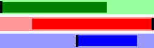
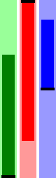

# Minichart - SVG Chart Generator

---

Create SVG mini charts with Ruby


---

* [Install](#install)
* [Usage](#usage)
* [Chart Types](#chart-types)
  * [Line Chart](#line-chart)
  * [Bar Chart](#bar-chart)
  * [Area Chart](#area-chart)
  * [Horizontal Bar Meter](#horizontal-bar-meter)
  * [Vertical Bar Meter](#vertical-bar-meter)
  * [Horizontal Status Leds](#horizontal-status-leds)
  * [Vertical Status Leds](#vertical-status-leds)
* [Configuration](#configuration)
  * [Class-level default options](#class-level-default-options)
  * [Instance initialization options](#instance-initialization-options)
  * [Instance-level options](#instance-level-options)
* [Options Reference](#options-reference)
  * [Basic Options](#basic-options)
  * [Meter Options](#meter-options)
  * [Leds Options](#leds-options)
* [Examples](#examples)


---

## Install

```shell
$ gem install minichart
```

Or with bundler:

```ruby
gem 'minichart'
```

## Usage

Require and optionally include the library:

```ruby
require 'minichart'
include Minichart
```

Initialize a chart with data, and optional options:

```ruby
data = [3, 1, 4, 1, 5, 9, 2, 6, 5, 3, 5, 9]
chart = AreaChart.new data, color: 'blue'
```

Get the full SVG output by calling `#render`:

```ruby
puts chart.render
#=> <?xml version="1.0" standalone="no"?>
#   <svg> ... </svg>
```

Save it to file, by calling `#save`:

```ruby
chart.save "my-chart.svg"
```

Get its inner SVG string by calling `#to_s`:

```ruby
puts chart.to_s
#=> <polyline fill="blue" stroke="blue" stroke-width="2" points="..."/>
```


The objects returned from all the mini chart classes are [Victor::SVG][2] objects, so they support all methods supported by it as well.

## Chart Types

### Line Chart


```ruby
LineChart.new [10, 30, 20, 40, 30], background: '#eee',
  height: 50, width: 250, color: 'green'
```

### Bar Chart


```ruby
BarChart.new [10, 30, 20, 40, 30], background: '#eee',
  height: 50, width: 250, color: 'green'
```

### Area Chart


```ruby
AreaChart.new [10, 30, 20, 40, 30], background: '#eee',
  height: 50, width: 250, color: 'green'
```

### Horizontal Bar Meter



```ruby
positive = HorizontalBarMeter.new 70,
  height: 20, width: 250, background: '#9f9', color: 'green'

negative = HorizontalBarMeter.new -80,
  height: 20, width: 250, background: '#f99', color: 'red'

dual = HorizontalBarMeter.new 80,
  height: 20, width: 250, background: '#99f', color: 'blue',
  mode: :dual, notches: [0]
```

Meter charts support [additional options](#meter-options).

### Vertical Bar Meter



```ruby
positive = VerticalBarMeter.new 70,
  width: 20, height: 250, background: '#9f9', color: 'green'

negative = VerticalBarMeter.new -80,
  width: 20, height: 250, background: '#f99', color: 'red'

dual = VerticalBarMeter.new 80,
  width: 20, height: 250, background: '#99f', color: 'blue',
  mode: :dual, notches: [0]
```

Meter charts support [additional options](#meter-options).

### Horizontal Status Leds


```ruby
HorizontalStatusLeds.new [1,1,-1,0,1,1,1,1,1,-1,-1,1],
  background: '#ccc'
```

Led charts support [additional options](#leds-options).

### Vertical Status Leds


```ruby
VerticalStatusLeds.new [1,1,1,1,-1,1,-1,1,0,1],
  background: '#ccc'
```

Led charts support [additional options](#leds-options).


## Configuration

Chart options can be set in one of three ways.

### Class-level default options

See or set default options for any chart class by calling its `::options` method:

```ruby
# See all options
p AreaChart.options
#=> {:background=>"white", :height=>100, :width=>300, :stroke=>2, :style=>{}, :color=>"#66f"}

# Set a single default option
AreaChart.options[:color] = '#333'

# Set multiple options at once
AreaChart.options background: 'black', color: 'green'
```

### Instance initialization options

Set options by providing a hash as the second argument on initialization:

```ruby
chart = AreaChart.new data, height: 120, width: 500
```

### Instance-level options

After initialization, you can still update individual options:

```ruby
chart = AreaChart.new data
chart.options[:background] = 'yellow'
```

## Options Reference

### Basic Options

#### background

Chart background color.

#### color

Chart color.

#### height

Chart height in pixels.

#### width

Chart width in pixels.

#### stroke

Line stroke width. This has a different effect in different chart types.

#### style

CSS Style hash to apply to the entire SVG.

#### padding

Chart padding in pixels.


### Meter Options

Meter charts support these options in additon to the basic options:

#### mode

Display mode. Can be `:positive`, `:negative`, `:dual` or `:auto` (default).

The `:auto` mode will switch between `:positive` and `:negative` based on the
value.

#### max

The absolute maximum value. This number should be positive even for negative
charts.

#### notches

An array of one or more levels to place a notch marker. Use positive values
only.

#### notch_thickness

Thickness of the notch markers.

#### notch_color

Color of the notch markers.

#### clipping_indicator

If true, show a marker when the value exceeds the range.

#### clipping_indicator_thickness

Thickness of the clipping indicator.

#### clipping_indicator_color

Color of the clipping indicator.

### Leds Options

Leds charts support these options in additon to the basic options (excluding
the `color` option):

#### positive_color

Color to use when the value is greater than 0.

#### negative_color

Color to use when the value is less than 0.

#### neutral_color

Color to use when the value is 0 or nil.

## Examples

See more examples (code and SVG output) in the [examples folder][1].

## Contributing / Support

If you experience any issue, have a question or a suggestion, or if you wish
to contribute, feel free to [open an issue][issues].

---

[1]: https://github.com/DannyBen/minichart/tree/master/examples#examples
[2]: https://github.com/DannyBen/victor
[issues]: https://github.com/DannyBen/minichart/issues