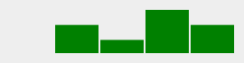
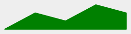

# Minichart - SVG Chart Generator

---

Create SVG mini charts with Ruby


---

## Install

```shell
$ gem install minichart
```

Or with bundler:

```ruby
gem 'minichart'
```

## Usage

Require and optionally include the library:

```ruby
require 'minichart'
include Minichart
```

Initialize a chart with data, and optional options:

```ruby
data = [3, 1, 4, 1, 5, 9, 2, 6, 5, 3, 5, 9]
chart = AreaChart.new data, color: 'blue'
```

Get the full SVG output by calling `#render`:

```ruby
puts chart.render
#=> <?xml version="1.0" standalone="no"?>
#   <svg> ... </svg>
```

Save it to file, by calling `#save`:

```ruby
chart.save "my-chart.svg"
```

Get its inner SVG string by calling `#to_s`:

```ruby
puts chart.to_s
#=> <polyline fill="blue" stroke="blue" stroke-width="2" points="..."/>
```


The objects returned from all the mini chart classes are [Victor::SVG][2] objects, so they support all methods supported by it as well.

## Chart Types

### Line Chart


```ruby
LineChart.new data, height: 50, background: '#eee',
  aspect_ratio: 5, color: 'green'
```

### Bar Chart



```ruby
BarChart.new data, height: 50, background: '#eee',
  aspect_ratio: 5, color: 'green'
```

### Area Chart



```ruby
AreaChart.new data, height: 50, background: '#eee',
  aspect_ratio: 5, color: 'green'
```

### Horizontal Bar Meter


```ruby
positive = HorizontalBarMeter.new 70,
  height: 20, width: 250, background: '#9f9', color: 'green'

negative = HorizontalBarMeter.new -80,
  height: 20, width: 250, background: '#f99', color: 'red'

dual = HorizontalBarMeter.new 80,
  height: 20, width: 250, background: '#99f', color: 'blue',
  mode: :dual, zero_line: true
```

Meter charts support [additional options](#meter-options).

## Options

### Basic Options

All chart classes support a second hash argument for options

```ruby
chart = LineChart.new data, options
```

| Option         | Default                      | Description                                                  |
| -------------- | ---------------------------- | ------------------------------------------------------------ |
| `background`   | `"white"`                    | Chart background color                                       |
| `color`        | `"#333"`                     | Chart color                                                  |
| `aspect_ratio` | `3`                          | Set automatic width                                          |
| `height`       | `100`                        | Chart height in pixels                                       |
| `width`        | Calculated by `aspect_ratio` | Chart width in pixels                                        |
| `stroke`       | `2`                          | Line stroke width.<br />In `BarChart` determines the gap between bars |
| `style`        | *None*                       | Style hash for the SVG                                       |


### Meter Options

Meter charts support these options in additon to the basic options:

| Option                     | Default   | Description                                                  |
| -------------------------- | --------- | ------------------------------------------------------------ |
| `mode`                     | `:auto`   | Display mode.<br />Can be `:positive`, `:negative`, `:auto` or `:dual` |
| `max`                      | `100`     | The absolute maximum value.<br />This number should be positive even for nengative charts |
| `zero_line`                | `false`   | If true, mark the zero line                                  |
| `zero_line_size`           | `6`       | Size of the zero line                                        |
| `zero_line_color`          | `"black"` | Color of the zero line                                       |
| `clipping_indicator`       | `false`   | If true, show when the value exceeds the range               |
| `clipping_indicator_size`  | `6`       | Size of the clipping indicator                               |
| `clipping_indicator_color` | `"yelow"` | Color of the clipping indicator                              |

## Examples

See more examples (code and SVG output) in the [examples folder][1].

---


[1]: https://github.com/DannyBen/minichart/tree/master/examples#examples
[2]: https://github.com/DannyBen/victor