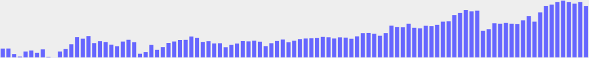

# Examples

## area chart

```ruby
require 'minichart'
include Minichart

data = [10, 30, 20, 40, 30]
plot = AreaChart.new data, background: '#eee', height: 50, width: 250, color: 'green'
plot.save 'area_chart'
```

[](examples/area_chart.rb.svg)


## bar chart

```ruby
require 'minichart'
include Minichart

data = [10, 30, 20, 40, 30]
plot = BarChart.new data, background: '#eee', height: 50, width: 250, color: 'green'
plot.save 'bar_chart'
```

[](examples/bar_chart.rb.svg)


## horizontal bar meter

```ruby
require 'minichart'
include Minichart

plot = HorizontalBarMeter.new 70, background: '#9f9', height: 20, width: 240, color: 'green'
plot.save 'horizontal_bar_meter'
```

[](examples/horizontal_bar_meter.rb.svg)


## larger data

```ruby
require 'minichart'
include Minichart

data = [739.31, 739.39, 729.61, 725.16, 734.15, 735.81, 731.97, 737.82, 724.81, 721.58, 734.16, 738.59, 746.92, 759.42, 756.85, 761.37, 748.96, 752.24, 750.82, 746.3, 743.38, 751.71, 754.81, 750.38, 730.17, 732.83, 745.86, 737.18, 741.87, 749.23, 751.8, 754.46, 754.72, 760.66, 758.44, 751, 752.24, 748.34, 748.7, 741.69, 745.95, 748.16, 752.42, 751.97, 753.39, 751.53, 743.56, 748.78, 752.68, 755.25, 750.29, 753.3, 756.05, 757.11, 757.38, 758.09, 759.95, 759.24, 757.11, 759.15, 758.71, 756.76, 760.92, 766.51, 766.86, 765.62, 761.99, 766.59, 779.8, 777.23, 776.87, 783.34, 776.17, 775.01, 779.62, 778.91, 781.3, 786.89, 787.68, 798.41, 802.66, 807.71, 805.23, 806.29, 770.94, 773.6, 783.96, 783.34, 784.67, 783.34, 782.9, 789.1, 796.46, 786.89, 803.28, 814.87, 817.2, 821.69, 824.2, 821.6, 818.73, 821.6, 814.78]
plot = BarChart.new data, width: 1000, background: '#eee'
plot.save 'larger_data'
```

[](examples/larger_data.rb.svg)


## line chart

```ruby
require 'minichart'
include Minichart

data = [10, 30, 20, 40, 30]
plot = LineChart.new data, background: '#eee', height: 50, width: 250, color: 'green'
plot.save 'line_chart'
```

[](examples/line_chart.rb.svg)


## multiple

```ruby
require 'minichart'
require 'victor'
include Minichart
include Victor

def random_data(size)
  srand 1000
  Array.new(size) { |i| rand i..(i + i * 10) }
end

options = { height: 60, width: 300, background: '#ccd' }

linechart = LineChart.new random_data(20), options.merge({ color: 'green' })
barchart  = BarChart.new  random_data(40), options.merge({ color: 'blue' })
areachart = AreaChart.new random_data(20), options.merge({ color: 'red' })

svg = SVG.new viewBox: "0 0 920 60"
svg.build do
  g(transform: "translate(0 0)")  { append linechart }
  g(transform: "translate(310 0)") { append barchart }
  g(transform: "translate(620 0)")  { append areachart }
end

svg.save 'multiple'
```

[](examples/multiple.rb.svg)


## multiple horizontal bars

```ruby
require 'minichart'
include Minichart
include Victor

positive = HorizontalBarMeter.new 70,
  height: 20, width: 250, background: '#9f9', color: 'green', notches: [0]

negative = HorizontalBarMeter.new -80,
  height: 20, width: 250, background: '#f99', color: 'red', notches: [0]

dual = HorizontalBarMeter.new 80,
  height: 20, width: 250, background: '#99f', color: 'blue',
  mode: :dual, notches: [0]

svg = SVG.new width: 250, viewBox: "0 0 250 70"
svg.build do
  g(transform: "translate(0 0)")  { append positive }
  g(transform: "translate(0 25)") { append negative }
  g(transform: "translate(0 50)") { append dual }
end

svg.save 'multiple_horizontal_bars'
```

[](examples/multiple_horizontal_bars.rb.svg)


## multiple vertical bars

```ruby
require 'minichart'
include Minichart
include Victor

positive = VerticalBarMeter.new 70,
  width: 20, height: 250, background: '#9f9', color: 'green', notches: [0]

negative = VerticalBarMeter.new -80,
  width: 20, height: 250, background: '#f99', color: 'red', notches: [0]

dual = VerticalBarMeter.new 80,
  width: 20, height: 250, background: '#99f', color: 'blue',
  mode: :dual, notches: [0]

svg = SVG.new width: 70, viewBox: "0 0 70 250"
svg.build do
  g(transform: "translate(0) 0")  { append positive }
  g(transform: "translate(25 0)") { append negative }
  g(transform: "translate(50 0)") { append dual }
end

svg.save 'multiple_vertical_bars'
```

[](examples/multiple_vertical_bars.rb.svg)


---

This file was generated automatically with `run examples readme`.